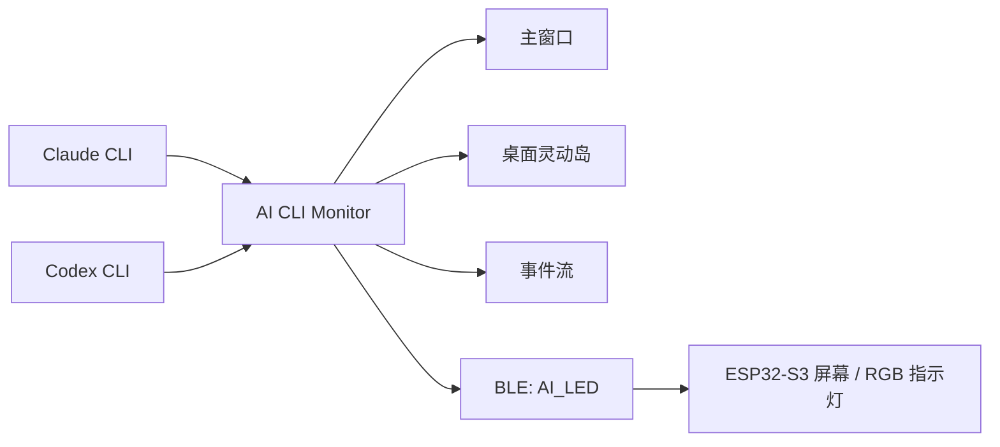

<div align="center">
  
  <h1>AI CLI Monitor</h1>
  <p><strong>监听 Claude CLI 与 Codex CLI 状态，并同步到桌面灵动岛、主窗口和 BLE 硬件的跨平台桌面工具。</strong></p>
  <p>
    <a href="#-中文">中文</a>
    ·
    <a href="README_EN.md">English</a>
    ·
    <a href="https://github.com/MSamor/AI-CLI-Monitor/releases">Releases</a>
  </p>

  <p>
    
    
    
    
    
    
    
    
  </p>

  <p>
    <a href="https://github.com/MSamor/AI-CLI-Monitor/stargazers"></a>
    <a href="https://github.com/MSamor/AI-CLI-Monitor/network/members"></a>
  </p>
</div>

---

AI CLI Monitor 是一个桌面工具，用来监听 Claude CLI 与 Codex CLI 的活动状态，并同步到主窗口、桌面灵动岛和可选的基于蓝牙的单片机设备，支持单片机屏幕显示和 RGB 指示灯控制。

### ✨ 软件作用

- 识别 Claude / Codex 当前是生成中、等待确认还是空闲，并在桌面实时展示。
- 通过桌面主窗口和灵动岛展示 Claude、Codex、蓝牙硬件和事件流。
- 可接入硬件“立创实战派 S3”，控制三色灯和屏幕显示执行状态。


- 在主窗口里开启或关闭 Claude / Codex Hook，减少手动配置成本。
- 通过 BLE GATT 同步状态到硬件设备，设备名为 `AI_LED`。

### 📸 桌面客户端截图

| 状态条 | 展开视图 | 主窗口 |
| --- | --- | --- |
| 可缩小为状态条展示 | 点击可展开详细信息 | 主窗口可以进行 Hook、灵动岛、蓝牙和事件流设置 |
|  |  |  |

### 🚦 状态规则

| 颜色 | 状态 | 说明 |
| --- | --- | --- |
| 🔴 红色 | `AI 生成中` | Claude 或 Codex 正在思考、调用工具、生成或流式输出。 |
| 🟡 黄色 | `等待确认` | AI 暂停在确认点，正在等待输入、授权或继续指令。 |
| 🟢 绿色 | `空闲` | Claude 与 Codex 当前没有正在进行的生成活动。 |

### 🧠 工作方式



AI CLI Monitor 在本机监听 Claude / Codex Hook 事件，将 CLI 活动归一化为 `running`、`waiting`、`idle` 三类状态，再映射到桌面 UI 和硬件灯效。硬件通道使用 Nordic UART 兼容的 BLE 服务，正常情况下不需要先在系统蓝牙中手动配对。

### 🚀 快速开始

正式包通过 GitHub Release 发布：

```text
https://github.com/MSamor/AI-CLI-Monitor/releases
```

按系统下载对应安装包：

| 系统 | 安装包 |
| --- | --- |
| Windows | `.exe` |
| macOS | `.dmg` 或 `.zip` |
| Linux | `.AppImage` 或 `.deb` |

### 🧩 首次使用

1. 启动应用程序。
2. 在主窗口的 Claude / Codex 卡片里打开 `Hook` 开关。
3. 点击开启灵动岛。
4. 继续使用你的 Codex 和 Claude Code，应用会显示运行状态。
5. 可选：准备立创实战派 S3 设备并刷入固件，即可支持屏幕显示和 RGB 指示灯。

> Hook 开关会根据检测到的 Claude / Codex 用户目录写入对应配置；如果应用提示未安装或配置异常，请先确认本机已经安装并初始化对应 CLI。

### 🔵 蓝牙硬件（立创实战派 S3）

https://github.com/user-attachments/assets/8ed78998-4235-4eb8-8ba8-64c0f0141891

固件在 `esp32-build` 文件夹中，烧录成功后启动设备就能自动连接到电脑监听状态。

如何烧录？请查看官方文档：[烧录教程](https://wiki.lckfb.com/zh-hans/szpi-esp32s3/beginner/design-flow.html)

硬件同步规则：

| 指令 | 含义 |
| --- | --- |
| `R` | 红色，AI 正在生成。 |
| `Y` | 黄色，等待确认。 |
| `G` | 绿色，空闲。 |

### 🛠️ 开发

环境要求：

- Node.js `>=18`
- npm
- 如需真实硬件联调，需要系统蓝牙权限和立创实战派 S3 设备

开发运行：

```bash
npm install
npm run dev
```

构建检查：

```bash
npm run typecheck
npm run build
```

运行测试脚本：

```bash
npm run test
```

本地打包：

```bash
npm run dist
```

打包产物输出到 `release/` 目录。macOS 生成 `dmg` 和 `zip`，Windows 生成 `exe` 和 `zip`，Linux 生成 `AppImage` 和 `deb`。

### 📁 目录结构

```text
.
├── build/                 # 应用图标、托盘图标和打包资源
├── esp32-build/           # 立创实战派 S3 固件产物
├── img/                   # README 截图和演示素材
├── pico/                  # 额外硬件脚本
├── scripts/               # Hook、包装器、测试和打包脚本
├── src/
│   ├── main/              # Electron 主进程、Hook、BLE、更新和状态管理
│   ├── preload/           # Electron preload
│   ├── renderer/          # React 桌面 UI 和灵动岛 UI
│   └── shared/            # IPC、协议、状态和类型定义
├── package.json
├── README_EN.md
└── README.md
```

### 📦 发布产物

| 平台 | electron-builder target | 说明 |
| --- | --- | --- |
| macOS | `dmg`、`zip` | 使用 `build/icon.icns`。 |
| Windows | `nsis`、`zip` | 使用 `build/icon.ico`。 |
| Linux | `AppImage`、`deb` | 分类为 `Development`。 |

### 📄 许可证

MIT License
