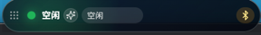
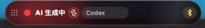
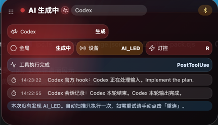
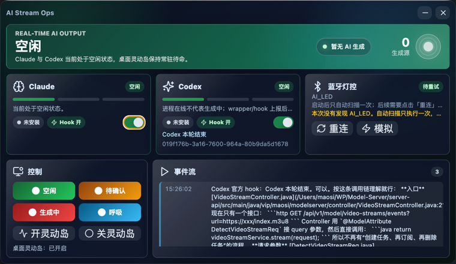

# AI CLI Monitor

AI CLI Monitor是一个 Electron 桌面工具，用来监听 Claude CLI 与 Codex CLI 的活动状态，并同步到主窗口、桌面灵动岛和可选的 Pico 2 W 基于蓝牙的 RGB 指示灯控制程序。

## 软件作用

- 识别 Claude / Codex 当前是生成中、等待确认还是空闲，状态在桌面展示
- 可连接 Pico 2 W BLE 指示灯：红色代表生成中，黄色代表等待确认，绿色代表空闲
- TODO 接入硬件-树莓派pico 2W 控制三色灯
- TODO 截图硬件-小屏幕动态展示

## 下载与更新

正式包通过 GitHub Release 发布：

```text
https://github.com/MSamor/AI-CLI-Monitor/releases
```

按系统下载对应安装包：

- Windows：`.exe`
- macOS：`.dmg` 或 `.zip`
- Linux：`.AppImage` 或 `.deb`

## 首次使用

1. 启动应用。
2. 在主窗口的 Claude / Codex 卡片里打开 `Hook` 开关。
3. 继续使用你的codex和claude，就会显示运行状态









应用会监听本机端口：

```text
Claude: http://127.0.0.1:17361/hooks/claude
Codex:  http://127.0.0.1:17361/hooks/codex
```

## 状态规则

- `红色 / AI 生成中`：Claude 或 Codex 正在思考、调用工具、生成或流式输出。
- `黄色 / 等待确认`：AI 暂停在确认点，正在等待输入、授权或继续指令。
- `绿色 / 空闲`：Claude 与 Codex 当前没有正在进行的生成活动。

Codex 进程存在不等于 AI 正在生成。应用会扫描 Codex 进程，但只有 hook 或会话事件确认有活动时才会点亮生成状态。

## 客户端使用

- 主窗口展示 Claude、Codex、蓝牙硬件和事件流。
- 桌面灵动岛可横向拖拽，松手后吸附到当前屏幕顶部。
- 点击灵动岛可展开详情，失焦后自动收回。
- 没有硬件时点击「模拟」切换到模拟蓝牙通道。
- 「手动灯控」可发送 `G/Y/R/B` 指令，用来验证 UI 和硬件链路。

## 蓝牙硬件

桌面端通过 BLE GATT 连接 Pico 2 W，不需要在系统蓝牙面板里手动配对。

目标设备名：

```text
AI_LED
```

桌面端只向 RX 写入一个字节：

- `G`：绿色，空闲
- `Y`：黄色，等待确认
- `R`：红色，AI 生成中
- `B`：蓝色呼吸灯

Pico 端参考：[pico/main.py](pico/main.py)

## 开发

开发运行：

```bash
npm install
npm run dev
```

没有蓝牙硬件时：

```bash
AI_MONITOR_BLE=mock npm run dev
```

构建检查：

```bash
npm run typecheck
npm run build
```

本地打包：

```bash
npm run dist
```

打包产物输出到 `release/` 目录。macOS 生成 `dmg` 和 `zip`，Windows 生成 `exe` 和 `zip`，Linux 生成 `AppImage` 和 `deb`。
