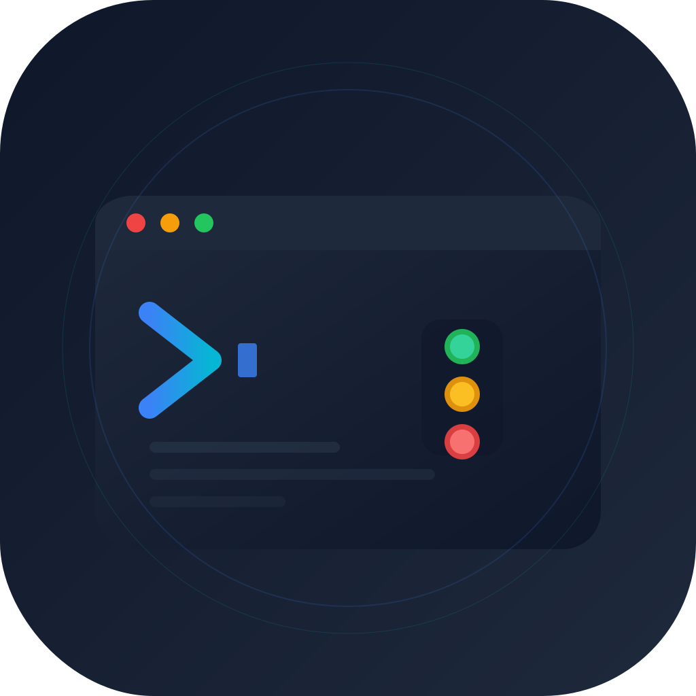
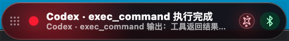
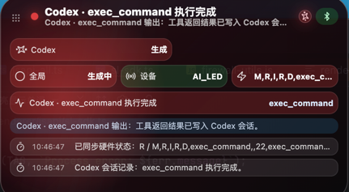
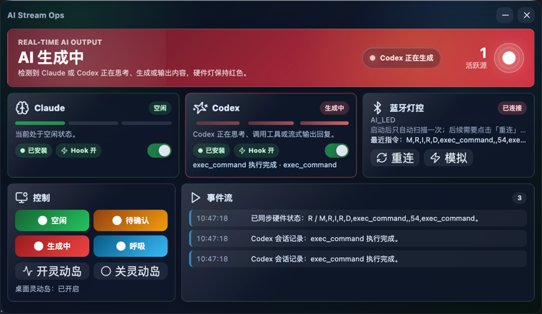
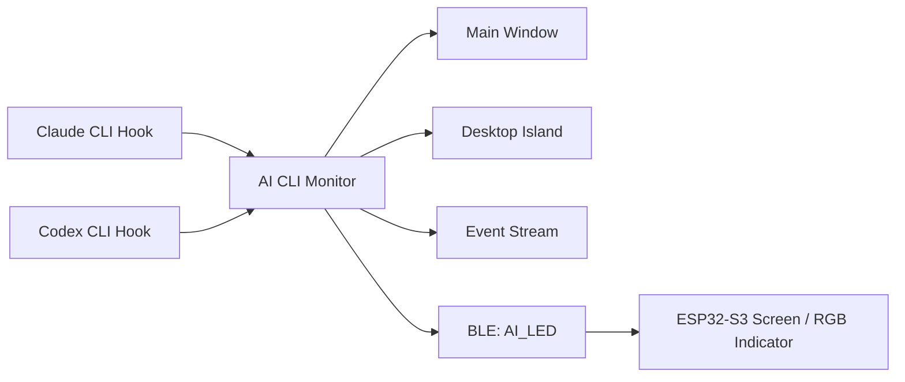

<div align="center">
  
  <h1>AI CLI Monitor</h1>
  <p><strong>A cross-platform desktop utility that monitors Claude CLI and Codex CLI status, then syncs it to a desktop island, main window, and BLE hardware.</strong></p>
  <p>
    <a href="README.md">中文</a>
    ·
    <a href="#-english">English</a>
    ·
    <a href="https://github.com/MSamor/AI-CLI-Monitor/releases">Releases</a>
  </p>

  <p>
    
    
    
    
    
    
    
    
  </p>

  <p>
    <a href="https://github.com/MSamor/AI-CLI-Monitor/stargazers"></a>
    <a href="https://github.com/MSamor/AI-CLI-Monitor/network/members"></a>
  </p>
</div>

---

## 🌍 English

AI CLI Monitor is a desktop utility that monitors Claude CLI and Codex CLI activity, then mirrors the status to the main desktop window, a desktop dynamic island, and an optional BLE-based microcontroller device with screen and RGB indicator support.

### 🧭 Contents

- [✨ What It Does](#-what-it-does)
- [📸 Screenshots](#-screenshots)
- [🚦 Status Rules](#-status-rules)
- [🧠 How It Works](#-how-it-works)
- [🚀 Quick Start](#-quick-start)
- [🧩 First Run](#-first-run)
- [🔵 BLE Hardware](#-ble-hardware)
- [🛠️ Development](#-development)
- [📁 Project Structure](#-project-structure)
- [📦 Release Artifacts](#-release-artifacts)
- [📄 License](#-license)

### ✨ What It Does

- 🔍 Detects whether Claude / Codex is generating, waiting for confirmation, or idle.
- 🖥️ Displays Claude, Codex, BLE hardware, and event stream status in the main window and desktop island.
- 🔴 Supports the LCKFB ESP32-S3 board for RGB indicator and screen status output.
- 🧷 Lets you enable or disable Claude / Codex hooks from the desktop UI.
- 📡 Syncs status to hardware through BLE GATT. The target device name is `AI_LED`.
- 📦 Ships official builds through GitHub Releases for Windows, macOS, and Linux.

### 📸 Screenshots

| Status Bar | Expanded View | Main Window |
| --- | --- | --- |
| Compact status display | Click to expand details | Hook, dynamic island, BLE, and event controls |
|  |  |  |

### 🚦 Status Rules

| Color | State | Meaning |
| --- | --- | --- |
| 🔴 Red | `AI Generating` | Claude or Codex is thinking, using tools, generating, or streaming output. |
| 🟡 Yellow | `Waiting for Confirmation` | The agent paused at a confirmation point and needs input, permission, or a continuation. |
| 🟢 Green | `Idle` | Claude and Codex have no active generation task. |

### 🧠 How It Works



AI CLI Monitor listens to local Claude / Codex hook events, normalizes activity into `running`, `waiting`, and `idle`, then maps those states to desktop UI and hardware indicators. The hardware channel uses a Nordic UART compatible BLE service and normally does not require manual pairing in the operating system Bluetooth panel.

### 🚀 Quick Start

Official builds are published through GitHub Releases:

```text
https://github.com/MSamor/AI-CLI-Monitor/releases
```

Download the package for your operating system:

| OS | Package |
| --- | --- |
| Windows | `.exe` |
| macOS | `.dmg` or `.zip` |
| Linux | `.AppImage` or `.deb` |

### 🧩 First Run

1. Launch the application.
2. Enable the `Hook` switch in the Claude / Codex cards.
3. Enable the desktop dynamic island.
4. Continue using Codex and Claude Code; the app will show their runtime status.
5. Optional: flash the firmware to an LCKFB ESP32-S3 board to enable screen and RGB indicator output.

> The Hook switch writes the matching Claude / Codex configuration based on detected user directories. If the app reports a missing installation or configuration error, initialize the corresponding CLI first.

### 🔵 BLE Hardware

https://github.com/user-attachments/assets/8ed78998-4235-4eb8-8ba8-64c0f0141891

The firmware is stored in `esp32-build`. After flashing, start the device and it can automatically connect to the desktop app and listen for status changes.

Flashing guide: [LCKFB official tutorial](https://wiki.lckfb.com/zh-hans/szpi-esp32s3/beginner/design-flow.html)

Hardware command mapping:

| Command | Meaning |
| --- | --- |
| `R` | Red, AI is generating. |
| `Y` | Yellow, waiting for confirmation. |
| `G` | Green, idle. |
| `B` | Blue breathing light for manual testing. |

### 🛠️ Development

Requirements:

- Node.js `>=18`
- npm
- System Bluetooth permission and an ESP32-S3 device for real hardware testing

Run locally:

```bash
npm install
npm run dev
```

Typecheck and build:

```bash
npm run typecheck
npm run build
```

Run the test script:

```bash
npm run test
```

Package locally:

```bash
npm run dist
```

Build artifacts are written to `release/`. macOS outputs `dmg` and `zip`, Windows outputs `exe` and `zip`, and Linux outputs `AppImage` and `deb`.

### 📁 Project Structure

```text
.
├── build/                 # App icons, tray icons, and packaging resources
├── esp32-build/           # ESP32-S3 firmware artifact
├── img/                   # README screenshots and demo media
├── pico/                  # Extra hardware script
├── scripts/               # Hooks, wrappers, tests, and packaging scripts
├── src/
│   ├── main/              # Electron main process, hooks, BLE, updater, state
│   ├── preload/           # Electron preload
│   ├── renderer/          # React desktop UI and dynamic island UI
│   └── shared/            # IPC, protocol, state, and shared types
├── package.json
├── README_EN.md
└── README.md
```

### 📦 Release Artifacts

| Platform | electron-builder target | Notes |
| --- | --- | --- |
| macOS | `dmg`, `zip` | Uses `build/icon.icns`. |
| Windows | `nsis`, `zip` | Uses `build/icon.ico`. |
| Linux | `AppImage`, `deb` | Categorized as `Development`. |

### 📄 License

This project declares the MIT License in `package.json`.
